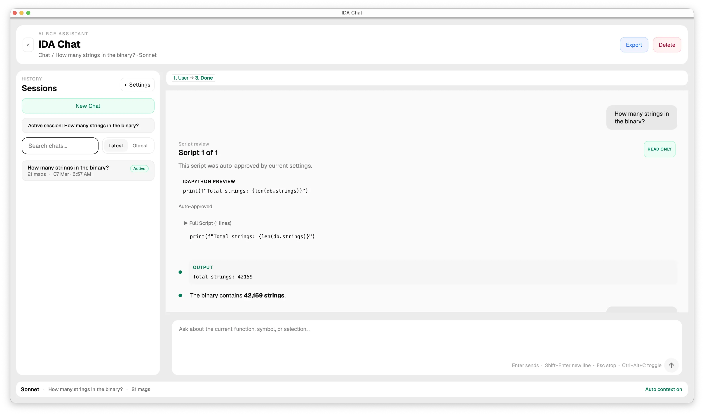
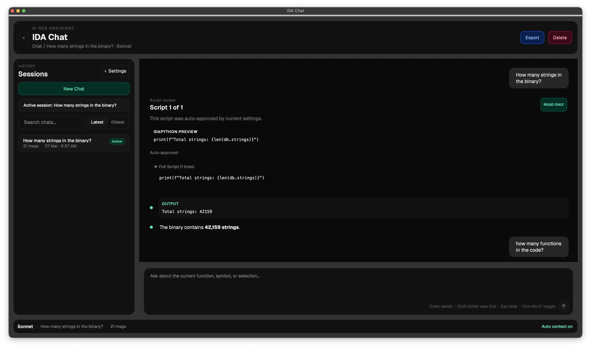
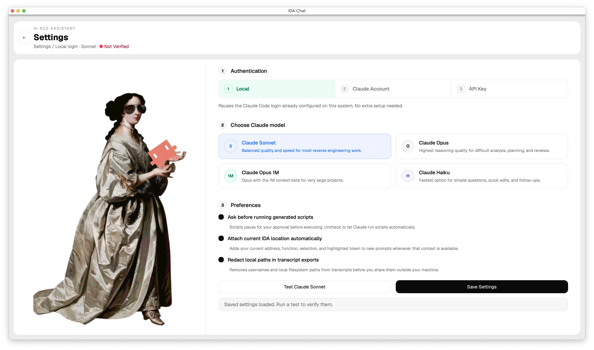
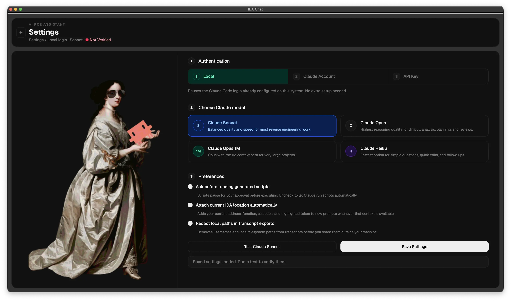

<div align="center">
  

  <h1>IDA Chat Plugin</h1>

  <p>
    <strong>AI-powered chat interface for IDA Pro — powered by Claude</strong>
  </p>

  <p>
    <a href="#screenshots">Screenshots</a> •
    <a href="#features">Features</a> •
    <a href="#requirements">Requirements</a> •
    <a href="#installation">Installation</a> •
    <a href="#usage">Usage</a> •
    <a href="#authentication">Authentication</a> •
    <a href="#uninstalling">Uninstalling</a> •
    <a href="#license">License</a>
  </p>

  <br/>
</div>

---

<a id="screenshots"></a>

## 🖼️ Screenshots

See the plugin in both light and dark mode before you even install it.

<table>
  <tr>
    <td align="center" width="50%">
      
      <br>
      <strong>Light Chat</strong>
    </td>
    <td align="center" width="50%">
      
      <br>
      <strong>Dark Chat</strong>
    </td>
  </tr>
  <tr>
    <td align="center" width="50%">
      
      <br>
      <strong>Light Settings</strong>
    </td>
    <td align="center" width="50%">
      
      <br>
      <strong>Dark Settings</strong>
    </td>
  </tr>
</table>

---

<a id="features"></a>

## ✨ Features

- **Dockable panel** — open from **View > IDA Chat** inside IDA
- **AI binary analysis** — ask anything about your binary; Claude responds with code and explanations
- **Automatic script execution** — Claude writes and runs IDA Python scripts against your open binary without any copy-paste
- **Script approval gate** — optional per-request approval before any script runs, with risk classification (read-only / mutating)
- **Context-aware prompts** — cursor position, current function name, and selected text are automatically attached to every message
- **Multi-session workspace** — maintain multiple named conversations per binary; switch, rename, delete, and export from the sidebar
- **Persistent history** — sessions saved to `~/.ida-chat/` scoped per binary, fully resumable across IDA restarts
- **Markdown rendering** — formatted responses with syntax-highlighted code blocks and collapsible long outputs
- **HTML transcript export** — export any session as a paginated HTML file for sharing or archiving
- **Model selection** — choose between Claude Sonnet, Opus, Opus 1M, and Haiku from the settings panel

---

<a id="requirements"></a>

## 📋 Requirements

| Requirement | Version                                        |
| ----------- | ---------------------------------------------- |
| IDA Pro     | 9.0 or later                                   |
| hcli        | Latest                                         |
| Claude      | API key, OAuth, or system auth via Claude Code |

---

<a id="installation"></a>

## 🚀 Installation

Make sure you have the latest version of [hcli](https://hcli.docs.hex-rays.com/) installed, then run:

```bash
hcli plugin install https://github.com/tanu360/ida-chat-plugin
```

On first launch, a setup wizard will guide you through choosing an authentication method and model.

---

<a id="usage"></a>

## 💡 Usage

1. Open a binary in IDA Pro (any supported format — PE, ELF, Mach-O, etc.)
2. Open **View > IDA Chat** to show the chat panel
3. Complete the setup wizard on first run — takes about 30 seconds
4. Type your question and press **Enter**

The plugin automatically captures the binary context (current function, cursor address, selection) and passes it to Claude with every message — no manual copy-paste needed.

### Example Prompts

| Goal                    | Prompt                                                    |
| ----------------------- | --------------------------------------------------------- |
| Explore functions       | `"List the main functions in this binary"`                |
| Analyze current address | `"Analyze the function at the current address"`           |
| Find issues             | `"Find potential vulnerabilities in this binary"`         |
| Understand code         | `"Explain what this function does"`                       |
| Clean up disassembly    | `"Rename variables in sub_401000 to be more descriptive"` |
| Cross-references        | `"What calls this function and from where?"`              |

### Keyboard Shortcuts

| Shortcut          | Windows / Linux  | macOS            |
| ----------------- | ---------------- | ---------------- |
| Send message      | `Enter`          | `Enter`          |
| New line          | `Shift+Enter`    | `Shift+Enter`    |
| Stop generation   | `Esc`            | `Esc`            |
| Message history   | `↑ / ↓`          | `↑ / ↓`          |

---

<a id="authentication"></a>

## 🔑 Authentication

Three authentication modes are supported, configurable from the setup wizard or settings panel:

| Mode        | Description                                                                                                              |
| ----------- | ------------------------------------------------------------------------------------------------------------------------ |
| **System**  | Reuses existing [Claude Code](https://claude.ai/code) credentials — no extra setup needed if you already use Claude Code |
| **API Key** | Anthropic Console API key — get one at [console.anthropic.com](https://console.anthropic.com)                            |
| **OAuth**   | Browser-based login via `claude setup-token`                                                                             |

The System auth mode is recommended if you already have Claude Code installed.

---

<a id="uninstalling"></a>

## 🗑️ Uninstalling

```bash
hcli plugin uninstall ida-chat
```

---

<a id="license"></a>

## 📜 License

This project is licensed under the [MIT License](LICENSE).

Copyright © 2026 Hex-Rays SA — [support@hex-rays.com](mailto:support@hex-rays.com)
